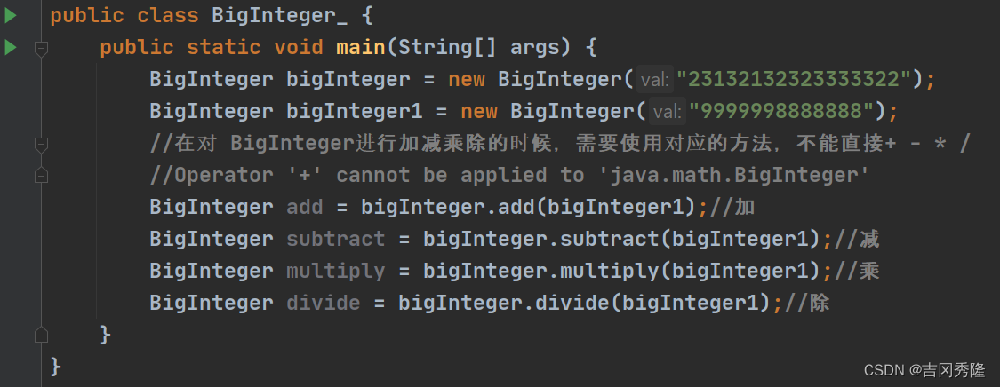
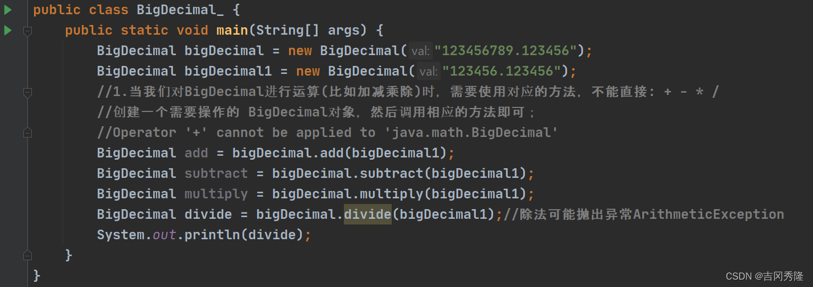
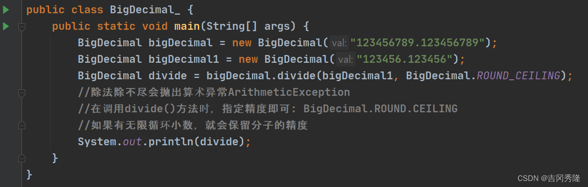

# ZCX的 Java 学习手稿

-----

[Java常用类，超详细整理，适合新手入门_java 类_~ 小团子的博客-CSDN博客](https://blog.csdn.net/qq_18817831/article/details/127496828)

## Java里的各种类

-----

## String 类

### 1. indexOf

indexOf 获取字符在字符串对象中第一次出现的索引,如果没有，返回-1

### 2. substring

substring(5) 从索引5开始截取后面所有的内容

### 3.toUpperCase

toUpperCase()转换成大写

### 4.concat

concat 拼接字符串, 本身不会改变str的值

### 5.replace

replace() 替换字符串的内容,不会改变str的值

### 6.split

split() 分割字符串，返回字符数组；如果有特殊字符，需要加入转义字符

### 7.toCharArray

toCharArray 将字符串转换成字符数组

### 8.compareTo

compareTo 比较两个字符串的大小

## StringBuilder类

## Arrays 类

[【精选】Java Arrays类_javaarrays类-CSDN博客](https://blog.csdn.net/qq_51542797/article/details/128386991)

### 1. toString()

### 2. sort()

[java中的Arrays.sort()的几种用法](https://blog.csdn.net/weixin_47872288/article/details/116721995)

### 3.binarySearch() 

二分查找 key 值

### 4.asList()

该方法是将数组转化成 List 集合的方法。

### 5.copyOf()

Arrays.copyOf(数组, key) => 数组元素的拷贝，拷贝指定个元素返回到新数组
拷贝长度 > 原数组长度，添null
拷贝长度 < 0，报异常

### 6.fill()

Arrays.fill()；数组元素的填充

### 7.equals()

Arrays.equals(数组1，数组2); 比较数组1、数组2内容是否完全一致

## Math类

### 1.pow()

pow(2，3)方法求幂；2^3

### 2.sqrt() 

开平方根

## BigInteger类

## BigDecimal类

适合保存精度更高的浮点型

除法可能抛出算术异常：
解决方案：在调用divide()方法时，指定精度即可 BigDecimal.ROUND.CEILING
如果有无限循环小数，就会保留分子的精度

