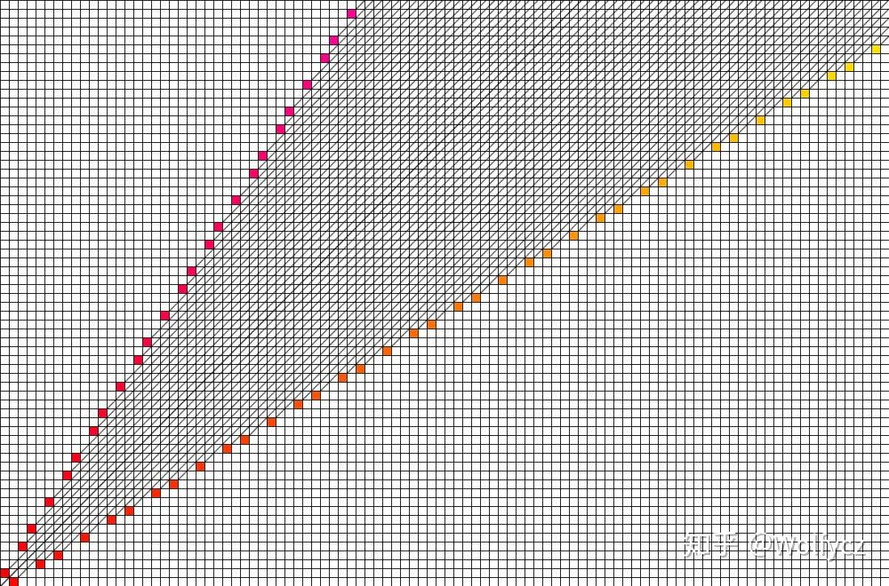
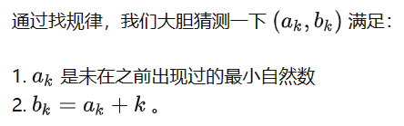

# SG函数

## 定义

SG函数用于解决公平组合游戏$（ICG）$ 的一种方法

$ICG$ :

​			1、两位玩家

​			2、两位玩家轮流操作，在一个有限集合内任选一个操作，改变游戏当前的局面

​			3、一个局面的合法操作，只取决于游戏局面本身且固定存在，与玩家次序和其他任何因素无关

​			4、无法操作者，即操作集合为空，输掉游戏，另一方获胜

$SG函数的定义$ :

对于一个$ICG$ 可以将状态描述成一个图，边即为操作方式，那么对于 $u$ 

​																		$SG(u) = MEX(SG(son(u)))$

$SG(x) = 0$ 的状态 $x$ 称为必败态，$SG(x) \neq 0$ 的状态 $x$ 被成为必胜态

## SG定理

> $SG(x + y) = SG(x) \bigoplus SG(y)$

可以解决多个 $IGC$ 组合起来的问题，例如最经典的Nim游戏：

> $n$ 堆数，Alice 和 Bob 每次可以任意选取一堆取任意数，Alice先手，无法操作者输，问谁会赢

对于任意一堆数 $x$ , $SG(x) = MEX(SG(x - 1),SG(X - 2),SG(X - 3),......,SG(1),SG(0)) = x$

所以整个游戏的 $SG = SG(a_1) \bigoplus SG(a_2) \bigoplus SG(a_3) \bigoplus ...... \bigoplus SG(a_n)$

即 $SG = a_1 \bigoplus a_2 \bigoplus a_3 \bigoplus a_4 \bigoplus ...... \bigoplus a_n$ 

$SG = 0$ 即为先手必败，其余必胜。

# 经典取石子游戏总结

## 1.巴什博弈

有一堆石子共n个，A和B轮流取，A先取。每次最少取1个，最多取m个，先取完者获胜（即没有石子取的人失败）。A与B都足够聪明，问A能否获胜。

结论：当n%(m+1)!=0时A必胜，否则必败。

## 2.斐波那契博弈

有一堆石子共n个，A和B轮流取，A先取。每次最少取1个。第一次不能取完。从第二次开始，每个人取的石子数至少为1，至多为前一个人取的石子数的2倍。先取完者获胜。A与B都足够聪明，问A是否获胜。

**Zeckendorf定理（齐肯多夫定理）**：任何正整数可以表示为若干个不连续的**Fibonacci数**之和。

结论：若n不是斐波那契数则A必胜，否则必败。

## 3.威佐夫博弈

两堆石子分别有n，m个，A和B轮流取，A先取。每次可以从一堆中取走任意数量的石子（至少取一个），或者从两堆中取出相同数量的石子，先取完者获胜。A与B都足够聪明，问A是否能获胜。

结论：当int(abs(m - n) * (√5 + 1) / 2) != min⁡(m, n)时A必胜，否则必败。

## 4.尼姆博奕

有n堆石子，每堆石子m[i]个，A和B轮流取，A先取。每次可以从某一堆中取任意个石子（至少取一个）。先取完者获胜。A与B都足够聪明，问A是否能获胜。

结论：当m[0] ^ m[1] ^ … ^ m[n - 1] != 0时A必胜，否则必败。

## 5.反尼姆博奕

有n堆石子，每堆石子m[i]个，A和B轮流取，A先取。每次可以从某一堆中取任意个石子（至少取一个）。先取完者失败。A与B都足够聪明，问A是否能获胜。

结论：统计石子个数大于1的堆数为a，设b=m[0]m[1]…m[n-1]，若(a&&b||!a&&!b)则A必胜，否则必败。

## 6.阶梯Nim

> $n$ 堆石子，两个人轮流取，每次可以在第 $i$ 堆石子里面选取若干石头放到 $i - 1$ 堆里面。谁不能操作算输（最终全部移到 $0$ 上）

结论：奇数堆 $SG$ 函数异或和

证明：将奇数位置当作一个 $Nim$ 游戏，假设当前先手必胜，那么先手只要按照奇数位置的 $Nim$ 游戏区进行就可以，后手若想赢则必须打破这个局面，只能将偶数位置的石子挪到奇数位置上，但先手仍能将后手移动的石子从奇数位置再挪到偶数位置上，对当前的局面不会造成任何影响。先手必败也是同理。

> n个格子，一些格子有石子，每次只能把一个石子朝左边移动一格，不能越过石子，不能操作者输。

把空格当作石子数，进行阶梯 $Nim$ 游戏即可。

## 7.$d$ 阶 $Nim$ 

> $n$ 堆石子，两人轮流取，每次可以取 $d$ 堆，谁不能操作谁输，问先手谁赢

结论：当且仅当在每一个不同的二进制位上，$x_1,x_2...x_k$ 中在该位上1的个数是 $N + 1$ 的倍数时，后手方有必胜策略，否则先手必胜。

## 8.Anti-SG 博弈

> 有两个顶尖聪明的人在玩游戏，游戏规则是这样的：
>
> 有 $n$ 堆石子，两个人可以从任意一堆石子中拿任意多个石子（不能不拿），拿走最后一堆石子的人失败，谁会赢？

$SJ$  定理 : 先手必胜当且仅当

​	1、	游戏的 $SG$ 函数不为 $0$，且游戏中某个单一游戏的 $SG$ 函数的值大于 $1$ 

​	2、    游戏的 $SG$ 函数为 $0$，且游戏中没有单一游戏的 $SG$ 函数大于 $1$

## 9.其他模型

- n个石子摆成一圈，A和B轮流取，A先取。每次可以取1个或者相邻的2个（中间有空位不算相邻），先取完者获胜。A与B都足够聪明，问A是否能获胜。

  结论：当n == 1 || n == 2时A必胜，否则必败。

- 有n堆石子，每堆石子m[i]个，A和B轮流取，A先取。每次至少从某一堆石子中取一个，每堆石子最多取x[i]个。先取完者获胜，A与B都足够聪明，问A是否能获胜。

  设a[i] = m[i] % (x[i] + 1)， b = a[0] ^ a[1] ^ … ^ a[n-1]。若b != 0则A必胜，否则必败。

- 有n堆石子，每堆石子m[i]个，A和B轮流取，A先取。每次从某一堆石子中取任意个（至少1个），且取好石子后还可以将剩余石子中的任意个放到其他的一堆或几堆中（一堆石子取完了就不能往这堆中放石子）。先取完者获胜，A与B都足够聪明，问A是否能获胜。

  统计每一个石子数出现的次数。若存在一个石子数的出现次数为偶数，则A必胜，否则必败。