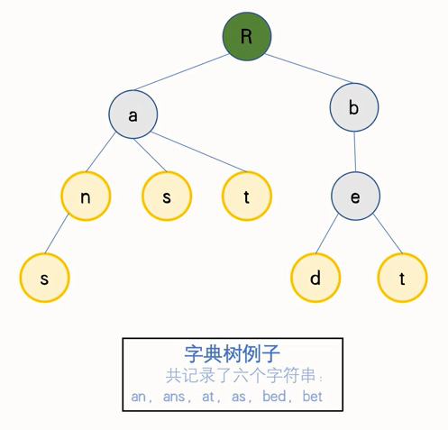
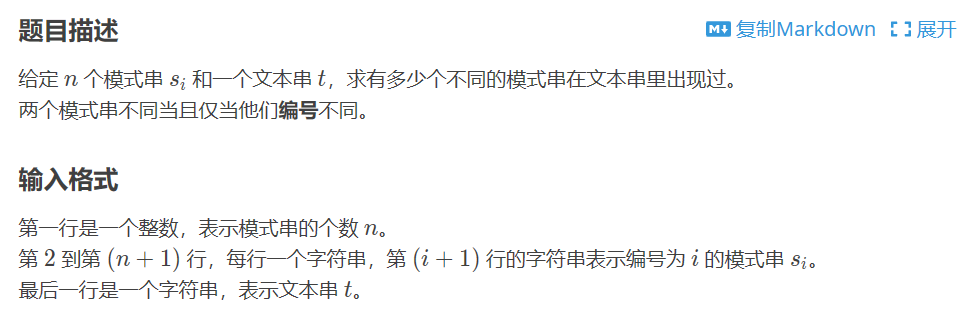

# 字符串相关

[TOC]


# 最小表示法

找到该串的循环串中字典序最小的

```c++
//最小表示法
string getmin(string ss) {
    int nn = ss.size(); //原长度
    ss = "?" + ss + ss;
    int i = 1, j = 2;  //i与j分别是两个不同的起始点
    while (j <= nn) {   //靠右的j不能超过结尾
        int k = 0;      //k为i,j后重复的长度
        while (k <= nn - 1 && ss[i + k] == ss[j + k])k++;
        if (ss[i + k] > ss[j + k])i = i + k + 1;
        else j = j + k + 1;
        if (i == j)j++; //这两步操作都是为了使j在i后，保证结束时i的位置就是答案
        if (i > j)swap(i, j);
    }
    string ans = ss.substr(i, nn);
    return ans;

    //第二种需求，求位置，则最小表示法所得字串起始位置为 i，返回i也行
}
```

# 字符串匹配问题

## KMP算法

快速**查询字符串p是否为字符串s的字串**，时间复杂度O( n + m )

```c++
int n, m;   //s的长度，p的长度
string s;
string p;
int nex[N]; //中继数组，表示p串前缀的重叠位置？很难解释（zcx废物
int f[N];   //结果数组，f[i]表示s串在 i-f[i]+1 到 i 位置这一段与p串在 1 到 f[i] 位置是相等的
//因此，当f[i]达到 m 时，表示p串再次被完全包含，m出现了几次，表示包含了几次
void kmp() {//查询p是否为s的字串，复杂度 O(n+m)
    n = s.size(), m = p.size();
    s = "?" + s; p = "?" + p;
    nex[1] = 0;
    int j = 0;
    for (int i = 2; i <= m; i++) {
        while (j > 0 && p[j + 1] != p[i]) {
            j = nex[j];
        }
        if (p[j + 1] == p[i])j++;
        nex[i] = j;
    }
    j = 0;
    for (int i = 1; i <= n; i++) {
        while ((j == m) || (j > 0 && p[j + 1] != s[i])) {
            j = nex[j];
        }
        if (p[j + 1] == s[i])j++;
        f[i] = j;
    }
}

```


## 扩展KMP算法

扩展KMP解决的是**源串Sa的每一个后缀**与**模式串Sb**的**最长公共前缀**的问题，并求出答案p数组，例如，ababac与aba的结果p数组是3 0 3 0 1 0

[P5410 【模板】扩展 KMP（Z 函数） - 洛谷 | 计算机科学教育新生态 (luogu.com.cn)](https://www.luogu.com.cn/problem/P5410)

算法复杂度  O(n + m)

```c++
int nex[N]; //中间数组，sb[1]与sb[i]起始的字串有长度为nex[i]重叠
int p[N];   //结果数组，sa[i]与sb[1]起始的字串有长度为p[i]重叠
void exkmp(string sa,string sb) {
    int n = sa.size(), m = sb.size();
    sa = "?" + sa; sb = "?" + sb;
    //先处理出nex数组
    int L = 1, R = 1;   //初始设定，L到R是之前得到的重复范围
    nex[1] = m;         //自己和自己的前缀和长度当然是本身的长度
    for (int i = 2; i <= m; i++) {
        if (i > R)nex[i] = 0;   //超过边界，只能靠自己了
        else {
            int k = i - L + 1;  // k是i在前缀区域的对应位置
            nex[i] = min(nex[k], R - i + 1);//取min防止超过边界R
        }
        while (i + nex[i] <= m && sb[i + nex[i]] == sb[nex[i] + 1]) {
            nex[i]++;   //探索未知
        }
        if (i + nex[i] - 1 > R) {
            R = i + nex[i] - 1; //扩展新的R与L
            L = i;
        }
    }
    //再用nex处理出p数组，基本同上
    L = 1, R = 1;
    for (int i = 1; i <= min(n, m); i++) {
        if (sa[i] == sb[i])p[1] = i;
        else break;
    }
    for (int i = 2; i <= n; i++) {
        if (i > R)p[i] = 0;
        else {
            int k = i - L + 1;
            p[i] = min(nex[k], R - i + 1);  //注意在此处就要使用k对应的nex数组了
        }
        while (i + p[i] <= n && sa[i + p[i]] == sb[p[i] + 1]) {
            p[i]++; //p[i]本身是对应sb串的，加上 i-1 之后才是在sa串上对应的位置
        }
        if (i + p[i] - 1 > R) {
            R = i + p[i] - 1;
            L = i;
        }
    }
}

void solve() {
    string a, b;
    cin >> a >> b;
    int n = a.size(), m = b.size();
    exkmp(a, b);
    //以下为本题要求，对nex和p数组处理出答案
    int ans = 0;
    for (int i = 1; i <= m; i++) {
        ans ^= i * (nex[i] + 1);
    }
    cout << ans << endl;

    ans = 0;
    for (int i = 1; i <= n; i++) {
        ans ^= i * (p[i] + 1);
    }
    cout << ans << endl;
}
```


# 回文子串问题

## Manacher算法

```c++
int n;          //原字符串长度
int p[N << 1];  //结果数组，p[i]表示在 i 位置的一侧有p[i]个属于回文串的字符，在数值上等于以i为中心的回文串长度+1
string s;       //原字符串
string s1;      //要使用的修改过的字符串，长度为 （2 * n + 3）

void manacher() {
    n = s.size();
    s1 += "@$";
    for (int i = 0; i < s.size(); i++) {
        s1 += s[i];
        s1 += "$";
    }
    s1 += "%";
    int m = 2 * n + 1;  //s1串的有效长度(不算两边的边界字符@和%)
    int M = 0, R = 0;   //已判断出的回文串中心 M 和右界 R
    for (int i = 1; i <= m; i++) {
        if (i > R) {    //进度走的太快，R跟不上
            p[i] = 1;
        }
        else {
            p[i] = min(p[2 * M - i], R - i + 1);//防止超过右侧边界R
        }
        while (s1[i - p[i]] == s1[i + p[i]]) {//探索未知的边界R右侧
            p[i]++;
        }
        if (i + p[i] - 1 > R) {//探索出的新边界，更新
            M = i;
            R = i + p[i] - 1;
        }
    }
    //根据题目需要处理结果数组p[i],但注意这时的i并不对应原字符串
    int ans = 1;
    for (int i = 1; i <= m; i++) {
        ans = max(ans, p[i] - 1);
    }
    cout << ans << endl;
}
```


# 字典树

十分方便的字符串处理方式，利用对**前缀相同的串**进行**前缀合并**的方式，对于n个长度不超过m的字符串，可以在O(m)的时间复杂度对**某个串和它的前缀**进行查询，是**空间换时间**的经典优化。



```c++
//注意此处的M为输入字符串的总长度，如果题目未明说，而是说n个长度至多为m的字符串，那么我们就要开n*m，因此，开出来的数组会相当大，绝对绝对不要用memset请多测，最好利用tot清
int nex[M][65];	//记录此节点的子节点编号
int isend[M];	//表示此编号节点是否为终止节点
int tot = 0;	//对新加入的点进行编号
int cnt[M];	//本题要求，用cnt[i]储存经过节点i的串数
int getnum(char cc) {	//映射操作，转字符为数字
	if (cc >= 'A' && cc <= 'Z')return cc - 'A';
	else if (cc >= 'a' && cc <= 'z')return cc - 'a' + 26;
	else return cc - '0' + 52;
}
void insert(string ss) {
	int now = 0, len = ss.size();
	for (int i = 0; i < len; i++) {
		int c = getnum(ss[i]);
		if (!nex[now][c]) {
			nex[now][c] = ++tot;//给经过的点留下编号
		}
		now = nex[now][c];	//向下个位置跳转
		cnt[now]++;//这是本题要求
	}
	isend[now] = 1;//已经走到结尾了，记录下结尾位置
}
int sum;
bool find(string ss) {
	int now = 0, len = ss.size();
	for (int i = 0; i < len; i++) {
		int c = getnum(ss[i]);
		if (!nex[now][c]) {
			return false;//走不下去了，说明没有存过前缀到这里的串
		}
		now = nex[now][c];//能走就接着查下去
	}
	sum = cnt[now];//这是本题的要求
	return isend[now];//看看符合条件的这个前缀是不是刚好到这结束
}

void solve() {
	int n, q;
	cin >> n >> q;
	string s;

	for (int i = 1; i <= n; i++) {
		cin >> s;
		insert(s);
	}
	while (q--) {
		cin >> s;
		sum = 0;
		find(s);
		cout << sum << endl;
	}
	//清多测，注意不要使用memset图省事，t似你
	for (int i = 0; i <= tot; i++) {
		for (int j = 0; j < 65; j++) {
			nex[i][j] = 0;
		}
		isend[i] = 0;
		cnt[i] = 0;
	}
	tot = 0;
}
```

 

# 以下为new


# 字符串Hash

非常简洁且好用的算法，在解决各式各样的匹配时最好优先想想。

在使用时尽量不要使用自然溢出以及单hash (比赛时很容易被卡)

双hash的base值取大于字符集大小的质数，p则是自定的模数

```c++
int hash(string ss,int base) {//个人爱好，base1=107，base2=137，p=9999971
    int nn = ss.size();
    int res = 0;
    for (int i = 0; i < nn; i++) {
        res = (res * base + ss[i] - 'a') % 9999971;
    }
    return res;
}
//利用前缀和的思想处理出s对应的hs[N]之后（hs[i]=hs[i-1]*base+s[i]-'a')
//s的任意字串 l-r 的hash值也可O(1)求得
int gethash(int l, int r, int base) {
    int p = 9999971;
    int step = hs[l - 1] * pow(base, r - l + 1) % p;
    return (hs[r] - step + p) % p;
}
```


# AC自动机

解决**多字符串匹配**问题：



如果使用KMP算法对n个串分别跑一遍匹配，则时间复杂度为 O（n*m），不是最优，此时就是AC自动机解决的问题。

AC自动机的实现是用字典树来解决KMP算法无法一次跑完n个串的匹配的问题**（字典树上跑KMP）**，因此其时间复杂度最优可以达到O（sizeof（s）），空间复杂度为字典树存储结构的空间复杂度。

但是此处为最优的时间复杂度，最坏可能会被卡到平方级别。

```c++
const int N = 1e6 + 5;

struct Tree {   //对字典树的改造
    int fail;   //此位置的失配指针
    int vis[26];//子节点的位置
    int num;    //标记有几个单词以这个节点结尾  
}AC[N];//Trie树本体
int tot = 0;    //Trie的指针

inline void Build(string s) {
    int nn = s.size();
    int now = 0;    //字典树的当前指针,初始为根节点0
    for (int i = 0; i < nn; i++){           //构造Trie树
        if (AC[now].vis[s[i] - 'a'] == 0)   //Trie树没有这个子节点
            AC[now].vis[s[i] - 'a'] = ++tot;//构造出来
        now = AC[now].vis[s[i] - 'a'];      //向下构造 
    }
    AC[now].num += 1;//标记单词结尾 
}
void Get_fail(){    //构造fail指针,对建好的Trie树进行改造
    queue<int> Q;   //队列 
    for (int i = 0; i < 26; i++){//第二层的fail指针提前处理一下
        if (AC[0].vis[i] != 0){
            AC[AC[0].vis[i]].fail = 0;//指向根节点
            Q.push(AC[0].vis[i]);//压入队列 
        }
    }
    while (!Q.empty()){ //BFS求fail指针 
        int u = Q.front();
        Q.pop();
        for (int i = 0; i < 26; ++i){   //枚举所有子节点
            if (AC[u].vis[i] != 0){     //存在这个子节点
                AC[AC[u].vis[i]].fail = AC[AC[u].fail].vis[i];
                //子节点的fail指针指向当前节点的
                //fail指针所指向的节点的相同子节点 
                Q.push(AC[u].vis[i]);   //该子节点压入队列 
            }
            else {  //不存在这个子节点 
                AC[u].vis[i] = AC[AC[u].fail].vis[i];
                //当前节点的这个子节点指向当
                //前节点fail指针的这个子节点 
            }
        }
    }
}
int AC_query(string ss){//AC自动机匹配
    int nn = ss.size();
    int now = 0, ans = 0;
    for (int i = 0; i < nn; i++){
        now = AC[now].vis[ss[i] - 'a']; //这一层的坐标
        for (int nex = now; nex && AC[nex].num != -1; nex = AC[nex].fail){//循环求解
            //nex代替now进行失配指针的跳跃，
            //满足nex到达根节点0或者此位置已经来过时退出循环
            ans += AC[nex].num;
            AC[nex].num = -1;   //加过了之后就不用再加了，标记为-1
        }
    }
    return ans;//本题要求的ans
}
void solve() {
    int n;
    string s;
    cin >> n;
    for (int i = 1; i <= n; i++) {
        cin >> s;
        Build(s);
    }
    AC[0].fail = 0; //结束标志
    Get_fail();     //求出失配指针
    cin >> s;       //文本串
    cout << AC_query(s) << endl;
}
```

