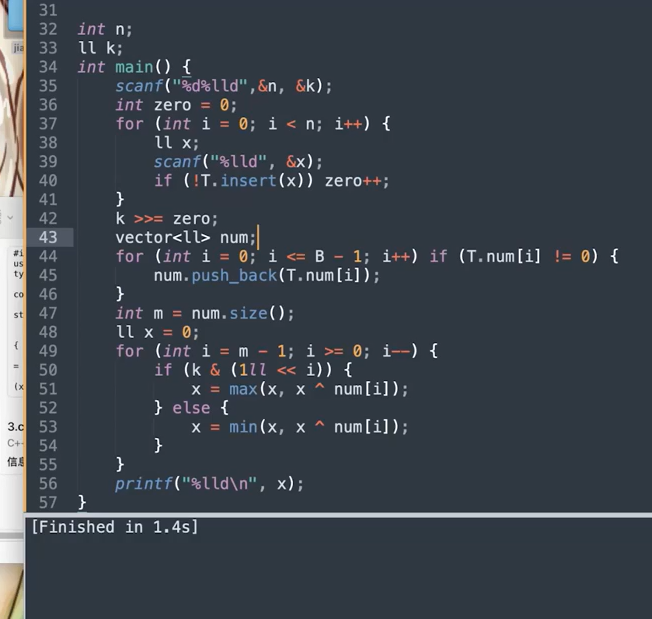
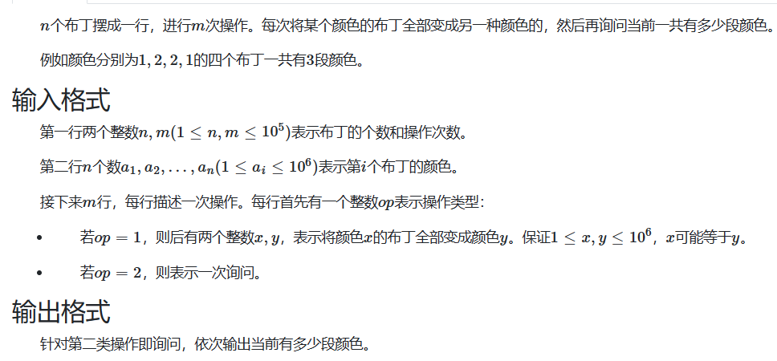

# 并查集进阶

## （带权并查集）


```c++
const int N = 2e5 + 10;

int root[N];    //根
int d[N];   //权值，记录当前节点到根节点的距离，修改时类似向量计算
int ans = 0;
void init_set() {   //初始化
    for (int i = 0; i < N; i++) { root[i] = i; d[i] = 0; }
}
int fi(int x) {
    if (x != root[x]) {
        int fa = root[x];//记录父节点
        root[x] = fi(root[x]);  //路径压缩
        d[x] += d[fa];  //权值更新为x到根节点的距离
    }
    return root[x];
}
void merge(int na, int nb, int v) { //合并，中间距离为v
    int roota = fi(na), rootb = fi(nb);
    if (roota == rootb) {   //两根已合并，判断是否与之前的数据矛盾
        if (d[na] - d[nb] != v)ans++;   //在本题中是小减大直接减
    }
    else {
        root[roota] = rootb;       //合并
        d[roota] = d[nb] - d[na] + v;   //左端点存值
    }
}
signed main() {
    int n, m;
    while (cin >> n >> m) {
        init_set();ans = 0;
        while (m--) {
            int a, b, v; cin >> a >> b >> v;
            a--;//根据区间合并原理，左端点需-1 
            merge(a, b, v);
        }
        cout << ans << endl;
    }
    return 0;
}
```


# 树状数组

[树状数组(详细分析+应用)，看不懂打死我!_树形数组_鲜果维他命的博客-CSDN博客](https://blog.csdn.net/TheWayForDream/article/details/118436732)

树状数组是一种支持 **单点修改** 和 **区间查询** 的，代码量小的数据结构。

经过差分改造，也支持**区间修改**和**单点查询**。

#### **单点修改** ， **区间查询** 

```c++
#define lowbit(x) ((x)&-(x))    //宏定义lowbit()函数
int tree[N];
void update(int x, int d) {//单点修改：修改元素 a[x]=a[x]+d
    while (x < N) {
        tree[x] += d;
        x += lowbit(x);
    }
}
int sum(int x) {
    int ans = 0;
    while (x > 0) {
        ans += tree[x];
        x -= lowbit(x);
    }
    return ans;
}
signed main() {	//使用
	for (int i = 1; i <= n; i++)update(i, a[i]);//初始化赋值tree[]数组
    cout << sum(8) - sum(4);    //查询区间和[5,8]
    update(5, 10);  //单点修改：a[5]=a[5]+10
    return 0;
}
```

#### 区间修改，单点查询

```c++
    //函数不变，但tree[]储存差分数组
    for (int i = 1; i <= n; i++) {
        cin >> l >> r >> d;
        update(l, d);   //范围修改
        update(r + 1, -d);
    }
    //查询 sum(i) 即为 a[i]
    cout << sum(i);
```


# 线段树模板


```c++
const int N = 1e5+10;
ll a[N];    //记录数列的元素
ll tree[N << 2];    //为第i个节点的值
ll tag[N << 2];     //为第i个节点的lazy_tag,记录这个区间的修改
inline ll lc(ll p){	return p << 1;	}	//左儿子
inline ll rc(ll p){ return p << 1 | 1; }//右儿子
void push_up(ll p){ //从下向上传递区间值
    tree[p] = tree[lc(p)] + tree[rc(p)];
}
void build(ll p,ll pl,ll pr){   //建树，p为结点编号，它指向区间[pl,pr]
    tag[p] = 0;
    if(pl==pr){
        tree[p] = a[pl];
        return;
    }
    ll mid = (pl + pr) >> 1;
    build(lc(p), pl, mid);  //建左儿子
    build(rc(p), mid + 1, pr);//建右儿子
    push_up(p); //向上传递区间值
}
void addtag(ll p,ll pl,ll pr,ll d){ //给结点p打tag标记，并更新tree
    tag[p] += d;
    tree[p] += d * (pr - pl + 1);   //计算新的tree
}
void push_down(ll p,ll pl,ll pr){   //不能覆盖时，把tag传递给子树
    if(tag[p]){ //有标记，这是之前区间修改时留下的
        ll mid = (pl + pr) >> 1;
        addtag(lc(p), pl, mid, tag[p]);
        addtag(rc(p), mid + 1, pr, tag[p]);
        tag[p] = 0; //p的tag被传走了，归0
    }
}
void update(ll L,ll R,ll p,ll pl,ll pr,ll d){//区间修改：[L,R]内每个元素加d
    if(L<=pl&&pr<=R){//符合范围，直接修改
        addtag(p, pl, pr, d);
        return;
    }
    push_down(p, pl, pr);   //如果不能覆盖，把tag传递给子树
    ll mid = (pl + pr) >> 1;
    if(L<=mid){
        update(L, R, lc(p), pl, mid, d);
    }
    if(R>=mid+1){
        update(L, R, rc(p), mid + 1, pr, d);
    }
    push_up(p);
}
ll query(ll L,ll R,ll p,ll pl,ll pr){	//查询区间[L,R]
    if(L<=pl&&pr<=R){   //完全覆盖，直接返回
        return tree[p];
    }
    push_down(p, pl, pr);//不能覆盖，递归子树
    ll res = 0;
    ll mid = (pl + pr) >> 1;
    if(L<=mid){ //左子节点有重叠
        res += query(L, R, lc(p), pl, mid);
    }
    if(R>=mid+1){
        res += query(L, R, rc(p), mid + 1, pr);
    }
    return res;
}
int main(){
    ll n, m;
    cin >> n >> m;
    for (ll i = 1; i <= n;i++)cin >> a[i];
    build(1, 1, n);	//建树，1 为结点编号，范围从 1 到 n
    while(m--){
        ll pan, x, y, k;
        cin >> pan;
        if(pan==1){
            cin >> x >> y >> k;
            update(x, y, 1, 1, n, k);
        }else{
            cin >> x >> y;
            cout << query(x, y, 1, 1, n) << endl;
        }
    }
    return 0;
}
```


# 线性基

```c++
ll xxj[65];		//线性基处理过的新数组，使用此数组内的值进行异或组合可以得到所有原数组的值
//大小应只用到0-61，（与ll的位数有关）
bool insert(ll xx) {
	int flag = 0;//是否能插入，（不能是因为xx已经可以被表示
	for (int i = 61; i >= 0; i--) {
		if (xx & (1ll << i)) {	//如果这一位有一
			if (!xxj[i]) {		//xxj数组这一位没有1，就无法表示这个数
				xxj[i] = xx;	//将其加入
				flag = 1;
				break;
			}
			else {
				xx ^= xxj[i];	//将这一位的影响消除，接着只需向更低的位数判断
			}
		}
	}
	return flag;
}
bool check(ll xx) {
	for (int i = 61; i >= 0; i--) {
		if (xx & (1ll << i)) {
			if (!xxj[i])return false;
			else xx ^= xxj[i];
		}
	}
	return true;
}
ll fimin() {//查询此数组可以异或出的最小值
	for (int i = 0; i <= 61; i++) {
		if (xxj[i])return xxj[i];
	}
	return 0;
}
ll fimax() {//查询此数组可以异或出的最大值
	ll ans = 0;
	for (int i = 61; i >= 0; i--) {
		ans = max(ans, ans ^ xxj[i]);
	}
	return ans;
}


```

**特殊：求第k小值**

```c++
ll xxj[65];		//线性基处理过的新数组，使用此数组内的值进行异或组合可以得到所有原数组的值
//大小应只用到0-61，（与ll的位数有关）
bool insert(ll xx) {
	int flag = 0;//是否能插入，（不能是因为xx已经可以被表示
	for (int i = 61; i >= 0; i--) {
		if (xx & (1ll << i)) {	//如果这一位有一
			if (!xxj[i]) {		//xxj数组这一位没有1，就无法表示这个数
				xxj[i] = xx;	//将其加入
				flag = 1;
				break;
			}
			else {
				xx ^= xxj[i];	//将这一位的影响消除，接着只需向更低的位数判断
			}
		}
	}
	return flag;
}
bool check(ll xx) {
	for (int i = 61; i >= 0; i--) {
		if (xx & (1ll << i)) {
			if (!xxj[i])return false;
			else xx ^= xxj[i];
		}
	}
	return true;
}
ll fimin() {//查询此数组可以异或出的最小值
	for (int i = 0; i <= 61; i++) {
		if (xxj[i])return xxj[i];
	}
	return 0;
}
ll fimax() {//查询此数组可以异或出的最大值
	ll ans = 0;
	for (int i = 61; i >= 0; i--) {
		ans = max(ans, ans ^ xxj[i]);
	}
	return ans;
}

int dp1[N];//改造线性基，类似于数位dp的处理，将每一位的0/1分开
int cnt = 0;//处理过后的1位置个数,同样也是新的线性基的个数
//根据这些位置有没有0/1可得到全部2^cnt个数
void exchange() {	//预处理，改造线性基
	for (int i = 0; i <= 61; i++) {
		for (int j = i - 1; j >= 0; j--) {//将i位以下的1全部归0
			if (xxj[i] & (1ll << j)) {
				xxj[i] ^= xxj[j];
			}
		}
		if (xxj[i])dp1[++cnt] = xxj[i];
	}
}
ll k_min(ll k) {//求第k小
	ll ans = 0;
	//忽略重复的数
	for (int i = 0; i < cnt; i++) {//将k拆分成2进制来判断需要哪几位上的1
		if (k & (1ll << i))ans ^= dp1[i];
	}
	return ans;
}
void solve() {
	int n;
	cin >> n;
	int k;//求第k小问题
	cin >> k;
	for (int i = 1; i <= n; i++) {
		ll x;
		cin >> x;
		insert(x);
	}
	//求第k小：情况1，计算重复的数，真正从2^n个结果中挑


	//求第k小：情况2，不计算重复的数
	exchange();
	ll maxk = 1ll << cnt;
	if (cnt < n && k == 1) {//k==1说明求最小值
		//cnt<n说明原数组中有数因为重复已被删掉，即可以构造出0
		cout << 0 << endl;
	}
	else {
		if (cnt < n)k--;//此时最小是0，减去这种情况
		if (maxk < k) {//不存在第k小的值
			cout << -1 << endl;
		}
		else {
			cout << k_min(k) << endl;
		}
	}
}

```




# 启发式合并



```c++
const int N = 1e5 + 5;
const int M = 1e6 + 5;

int a[N];       //每个位置对应的颜色，注：此处的颜色仅用来区分不同颜色，已经与初始时分配的颜色不同了
vector<int>pos[M];//每种颜色对应的位置
int ans = 0;    // ans-1 总颜色数，动态维护

void solve(){
    int n, m;
    cin >> n >> m;
    for (int i = 1; i <= n; i++) {
        cin >> a[i];
        pos[a[i]].push_back(i);
    }
    for (int i = 1; i <= n + 1; i++) {
        ans += a[i] != a[i - 1];//有边界的情况下
    }
    while (m--) {
        int op;
        cin >> op;
        if (op == 2) {
            cout << ans - 1 << endl;
        }
        else {
            int x, y;
            cin >> x >> y;
            if (x == y)continue;
            if (pos[x].size() > pos[y].size()) {
                swap(pos[x], pos[y]);//每次只将较小的范围并入较大的范围
            }
            if (pos[y].empty())continue;
            auto modify = [&](int p, int col) {
                ans -= (a[p] != a[p - 1]) + (a[p] != a[p + 1]);
                a[p] = col;
                ans += (a[p] != a[p - 1]) + (a[p] != a[p + 1]);
            };
            int col = a[pos[y][0]];
            for (int p : pos[x]) {
                modify(p, col);
                pos[y].push_back(p);//只有pos对应的位置值得相信
            }
            pos[x].clear();
        }
    }
}
```


