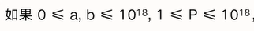
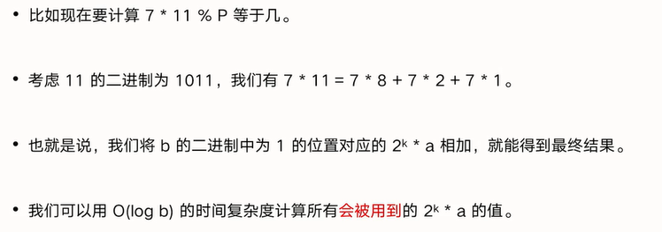
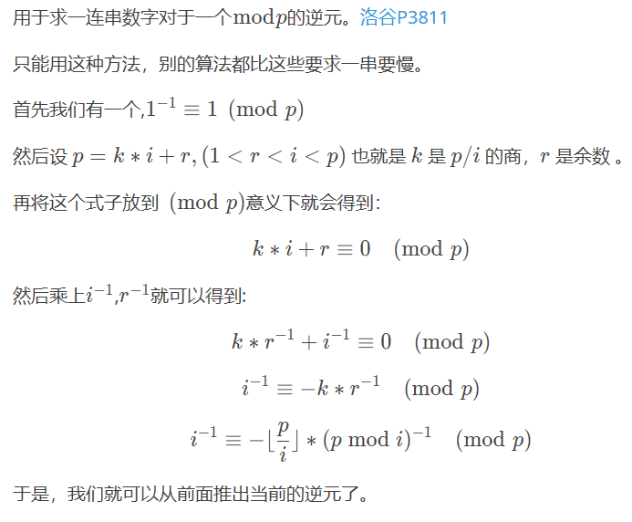
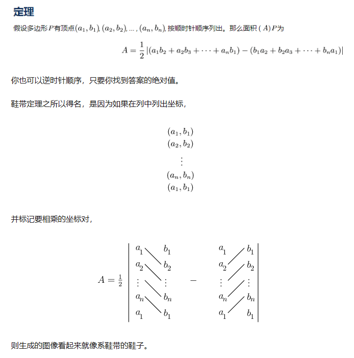
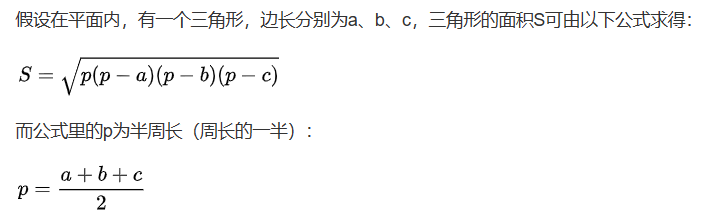
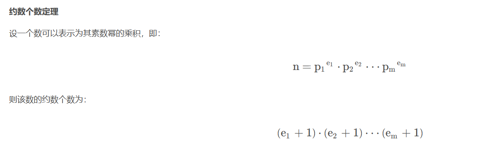

[TOC]


# 素数筛（埃氏筛）

**（使用bitset加快速度)**

```c++
bitset<N> isprime;  //素数筛（埃氏筛）（使用bitset加快速度)
void PrePrime(int an) {  //预处理   //正常当成bool数组用就行
    isprime.set();      //将每一位都设置为 1
    isprime[0] = isprime[1] = 0;
    for (int i = 2; i * i <= an; i++) {
        if (isprime[i]) {
            for (int j = i << 1; j <= an; j += i) isprime[j] = 0;
        }
    }
}
```

# **快速乘**

计算 a * b % p 问题时，可能出现 p > 1e9 的情况，此时无法使用 ll 。





```c++
inline ll quic_mul(ll aa, ll bb, ll pp) {
	ll ans = 0;
	aa %= pp;
	while (bb) {
		if (bb & 1) {
			ans = (ans + aa) % pp;
		}
		aa = (aa + aa) % pp;
		bb >>= 1;
	}
	return ans;
}
```


# 快速幂相关

## 普通

```c++
ll quicpow(ll xa, ll xb) {  //快速幂板子
    ll res = 1;
    while (xb) {
        if (xb & 1) res = res * xa % mod;
        xa = xa * xa % mod;
        xb >>= 1;
    }
    return res;
}
```

## 矩阵快速幂

思路同普通快速幂，不过底数变成了矩阵（正方矩阵），其单位1也需要人为构造：


```c++
struct ju {
    ll a[N][N];
    ju() {  memset(a, 0, sizeof(a));  }
    void set1() {
        for (int i = 1; i <= n; i++) {
            a[i][i] = 1;
        }
    }
};
ju operator*(const ju& aa, const ju& bb) {
    ju z;
    for (int k = 1; k <= n; k++) 
        for (int i = 1; i <= n; i++) 
            for (int j = 1; j <= n; j++) 
                z.a[i][j] = (z.a[i][j] + aa.a[i][k] * bb.a[k][j] % mod) % mod;
    return z;
}
ju quic_pow_ju(ju aa, ll bb) {
    ju ans;
    ans.set1();
    while (bb) {
        if (bb & 1) {
            ans = ans * aa;//此处的 %mod 借助 * 的重载来实现
        }
        aa = aa * aa;
        bb >>= 1;
    }
    return ans;
}
```


## 欧拉定理相关


(按照我的理解，欧拉定理用于解决b与mod互质的情况，而大部分情况下，两者可能并不互质，所以扩展欧拉定理才会在 b % oulam 后**再加上一个 oulam** 来防止b为0)

**(但在 b < oulam 时，绝对不要再加 oulam ！血的教训！)**

**欧拉函数性质**


```c++
//欧拉函数：
//表示的是小于等于 n 的，和 n 互质的数的个数
int oula(int nn) {
    int ans = nn;
    for (int i = 2; i * i <= nn; i++) {
        if (nn % i == 0) {
            ans = ans / i * (i - 1);
            while (nn % i == 0)nn /= i;
        }
    }
    if (nn != 1) {
        ans = ans / nn * (nn - 1);
    }
    return ans;
}
```


一般扩展欧拉定理用于求**特大幂指数**（大的只能用 string 读那种）的计算，如：求a^b%m


```c++
int main() {
    int a, m;
    string s;
    cin >> a >> m;
    cin >> s;
    int oulam = oula(m);
    int b = 0;
    int flag = 0;//在b小于oulam时，不能加oulam！
    for (int i = 0; i < s.size(); i++) {
        b = b * 10 + s[i] - '0';
        if (b > oulam) {
            flag = 1;
            b %= oulam;
        }
    }
    if (flag) {
        b = b % oulam + oulam;
    }
    cout << quic_pow(a, b, m) << endl;

    return 0;
}
```


# 乘法逆元


**1、快速幂法---费马小定理**


```c++
ll quicpow(ll xa, ll xb, ll pp) {   //快速幂板子,pp 传入 mod值
    ll res = 1;
    while (xb) {
        if (xb & 1) res = res * xa % pp;
        xa = xa * xa % pp;
        xb >>= 1;
    }
    return res;
}
ll niyuan(ll xa, ll pp) {      //费马小定理求逆
    return quicpow(xa, (ll)pp - 2, (ll)pp);//即求出了逆元形势下的 1/x
}
```


**2、扩展欧几里得求逆元**

优点：同样适用于mod不是质数的情况

原理：	k1 * a =  1 ( mod p )

​				可转化为：k1 * a + k2 * p = 1

```
ll niyuan(ll n, ll p) {
    ll k1 = 1, k2 = 1;
    exgcd(k1, n, k2, p);
    return (k1 % p + p) % p;
}
```


**3、线性递推求逆元**

很少使用，可以在O( n ) 复杂度下实现对1-n内所有数求逆元，同样允许非质mod数



```c++
ll inv[N];//逆元数组，由inv[0]=0与inv[1]=1向后递推

void solve() {
    int n, p;       //求1-n在mod p下的逆元，需求线性复杂度
    cin >> n >> p;
    inv[0] = 0; inv[1] = 1;
    for (int i = 2; i <= n; i++) {//(p-p/i)是为了将公式中的-p/i转为正数
        inv[i] = (ll)(p - p / i) * (inv[p % i]) % p;
    }
    for (int i = 1; i <= n; i++) {
        cout << inv[i] << endl;
    }
}
```


# 排列组合

**（应用逆元）**

```c++
const int N = 1e6 + 5; //从N = maxn个物品中选x个
const ll mod = 1e9 + 7; //本题模数

ll fact[N]/*i的阶乘*/, infact[N]/*i的阶乘的逆*/;
ll quicpow(ll xa, ll xb, ll pp) {    //快速幂板子,pp 传入 mod值
    ll res = 1;
    while (xb) {
        if (xb & 1) res = res * xa % pp;
        xa = xa * xa % pp;
        xb >>= 1;
    }
    return res;
}
void preinit() {	//预处理
    fact[0] = infact[0] = 1;
    for (int i = 1; i < N; i++)fact[i] = fact[i - 1] * i % mod;	//  i!
    infact[N - 1] = quicpow(fact[N - 1], (ll)mod - 2, (ll)mod);	//  1/(i!)
    for (int i = N - 2; i; i--)infact[i] = infact[i + 1] * (ll)(i + 1) % mod;  //  1/i!=(i+1)/(i+1)!
}
int C(int na, int nb) {//从na个物品中选nb个
    if (na < nb)return 0;
    return (fact[na] * infact[nb] % mod * infact[na - nb] % mod) % mod;
}
```

# 扩展欧几里得算法相关

## 最小公因gcd(x,y)

```c++
int gcd(int x, int y) {
	return y ? gcd(y, x % y) : x;
}
```

## 最小公倍lcm(x,y)

```c++
int lcm(int x, int y) {
	return x * y / gcd(x, y);
}
```

## 扩展欧几里得

[扩展欧几里得算法详解__Warning_的博客-CSDN博客](https://blog.csdn.net/destiny1507/article/details/81750874)

**给定整数x, y，求k1, k2使得 k1 * x + k2 * y = gcd(x, y)**

```c++
//给定整数x, y，求k1, k2使得 k1 * x + k2 * y = gcd(x, y)
//k1,k2的输入值任意，在返回时才会进行赋值，最后修改为符合上式的值
int exgcd(int& k1, int x, int& k2, int y) {//扩展欧几里得算法
    if (y == 0) {
        k1 = 1; k2 = 0;
        return x;  //到达递归边界开始向上一层返回
    }
    int ans = exgcd(k1, y, k2, x % y);
    int step = k2;    //把k1 k2变成上一层的
    k2 = k1 - (x / y) * k2;
    k1 = step;
    return ans;     //最终返回x y的最大公因数gcd
}
```

## 二元线性丢番图方程


# 线性代数相关

## 高斯消元--高阶行列式求值

时间复杂度为 n * n * (n + log n)

主要思路，利用换行相减等方法转换为上三角行列式，则其值为主对角线值的积

eg:

[P7112 【模板】行列式求值 - 洛谷 | 计算机科学教育新生态 (luogu.com.cn)](https://www.luogu.com.cn/problem/P7112)

```c++
int n;
ll a[N][N];

ll Gauss(ll MOD) {
    ll ans = 1, fu = 1;// fu 记录调换行时引起的结果符号变化
    for (int i = 1; i <= n; i++) {
        for (int j = i + 1; j <= n; j++) {
            while (a[i][i]) {//借用a[i][i]使用辗转相减将下方的a[j][i]转化为0
                ll div = a[j][i] / a[i][i];
                for (int k = i; k <= n; k++) {
                    a[j][k] = ((a[j][k] - div * a[i][k]) % MOD + MOD) % MOD;
                }
                swap(a[i], a[j]);
                fu = -fu;
            }
            swap(a[i], a[j]);//最后再换回来，同时解决了a[i][i]为0时的情况
            fu = -fu;
        }
    }
    for (int i = 1; i <= n; i++) {
        ans = ans * a[i][i] % MOD;
    }
    ans = (ans * fu + MOD) % MOD;
    return ans;
}

int main() {
    ios::sync_with_stdio(false);
    cin.tie(0); cout.tie(0);

    cin >> n;
    ll mod;
    cin >> mod;
    for (int i = 1; i <= n; i++) {
        for (int j = 1; j <= n; j++) {
            cin >> a[i][j];
            a[i][j] %= mod;
        }
    }
    cout << Gauss(mod) << endl;

    return 0;
}
```


# 平面几何相关

## 鞋带定理（用坐标表示的多边形面积）

**求在平面上的给定多边形面积（不管凹凸）**



举例（三角形）

```c++
struct Point {  double x, y;  };
double GetS(Point aa, Point bb, Point cc) {
    double step1 = aa.x * bb.y + bb.x * cc.y + cc.x * aa.y;
    double step2 = aa.x * cc.y + bb.x * aa.y + cc.x * bb.y;
    return abs(step1 - step2) / 2;
}
```


## 海伦公式（三角形面积）

**已知三角形三边长，求其面积**



```c++
//注意在使用前就要判断一下这三条便能不能构成三角形
double GetS(double aa, double bb, double cc) {
    double p = (aa + bb + cc) / 2;
    return sqrt(p * (p - aa) * (p - bb) * (p - cc));
}
```


# 多项式相关

## 秦九韶公式

有一个n阶多项式，求值，在带入 x 时一般要进行大量的乘法计算，此时可以用秦九韶公式进行加速，（其实也没什么用）

普通计算（ n * n )  -> 快速幂加速 （n * log n ) -> 秦九韶 （ n ）

```c++
int n;		//最高项系数
double a[N];// a[i] 表示 a ^ i 项系数
double fi(double xx) {
	double sum = 0;
	for (int i = n; i >= 0; i--) {//递推关系，从大项向小项
		sum = sum * xx + a[i];
	}
	return sum;
}
```


# Miller-Rabin素数测试算法

[Miller-Rabin素数测试算法_millerrabin素数测试算法_forever_dreams的博客-CSDN博客](https://blog.csdn.net/forever_dreams/article/details/82314237)

```c++

#include<cstdio>
#include<cstring>
#include<algorithm>
using namespace std;
int prime[10]={2,3,5,7,11,13,17,19,23,29};
int Quick_Multiply(int a,int b,int c)  //快速积（和快速幂差不多） 
{
    long long ans=0,res=a;
    while(b)
    {
        if(b&1)
          ans=(ans+res)%c;
        res=(res+res)%c;
        b>>=1;
    }
    return (int)ans;
}
int Quick_Power(int a,int b,int c)     //快速幂，这里就不赘述了 
{
    int ans=1,res=a;
    while(b)
    {
        if(b&1)
          ans=Quick_Multiply(ans,res,c);
        res=Quick_Multiply(res,res,c);
        b>>=1;
    }
    return ans;
}
bool Miller_Rabin(int x)     //判断素数 
{
    int i,j,k;
    int s=0,t=x-1;
    if(x==2)  return true;   //2是素数 
    if(x<2||!(x&1))  return false;     //如果x是偶数或者是0,1，那它不是素数 
    while(!(t&1))  //将x分解成(2^s)*t的样子 
    {
        s++;
        t>>=1;
    }
    for(i=0;i<10&&prime[i]<x;++i)      //随便选一个素数进行测试 
    {
        int a=prime[i];
        int b=Quick_Power(a,t,x);      //先算出a^t
        for(j=1;j<=s;++j)    //然后进行s次平方 
        {
            k=Quick_Multiply(b,b,x);   //求b的平方 
            if(k==1&&b!=1&&b!=x-1)     //用二次探测判断 
              return false;
            b=k;
        }
        if(b!=1)  return false;   //用费马小定律判断 
    }
    return true;   //如果进行多次测试都是对的，那么x就很有可能是素数 
}
int main()
{
    int x;
    scanf("%d",&x);
    if(Miller_Rabin(x))  printf("Yes");
    else  printf("No");
    return 0;
}
```


# NEW


# 约数个数定理

快速求约数个数



最快是$O(\log n)$，最环情况下为$O(\sqrt n)$

[高度可除的三角数 - 洛谷 ](https://www.luogu.com.cn/problem/U265394)

```c++
// 用【唯一分解定理】更快速的求出约数个数
int get1(int nn) {   // 根号 n 的复杂度，快速求因数个数
    int ans = 1;
    for (int i = 2; i * i <= nn; i++) {
        if (nn % i == 0) {
            int cnt = 0;
            while (nn % i == 0) {
                cnt++;
                nn /= i;
            }
            ans *= (cnt + 1);
        }
    }
    if (nn > 1) {//没除尽
        ans *= 2;
    }
    return ans;
}

int get2(int nn) {//普通算法，超时
    int ans = 0;
    for (int i = 1; i * i <= nn; i++) {
        if (nn % i == 0) {
            if (i * i == nn)ans++;
            else ans += 2;
        }
    }
    return ans;
}

void solve() {
    int n;
    cin >> n;
    for (int i = 1; 1; i++) {
        int sum = (i + 1) * i / 2;
        if (get2(sum) > n) {
            cout << sum << endl;
            return;
        }
    }
}

```

